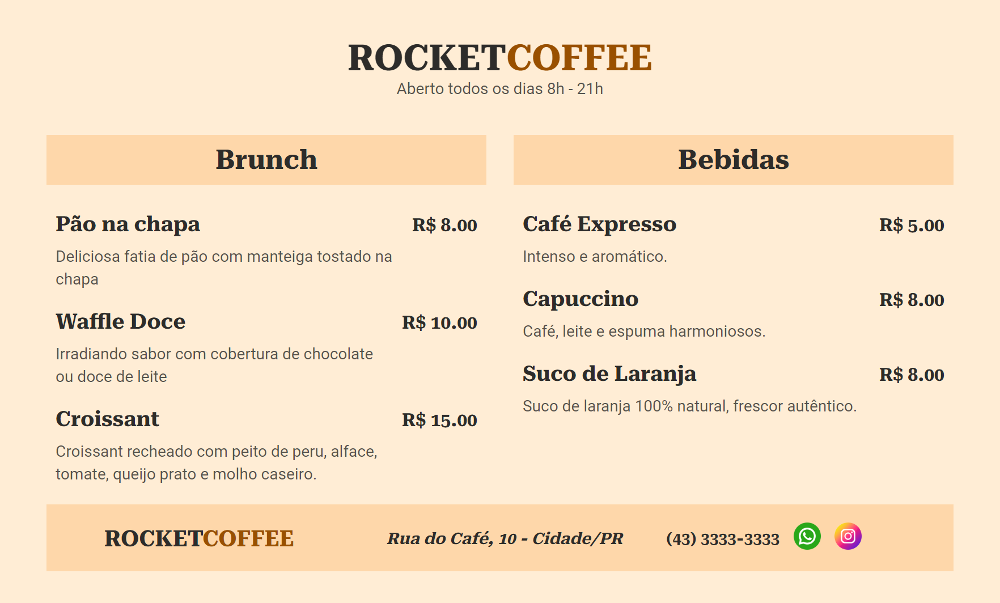

# Maratona Explorer 3.0

Menu digital super prático e clean! Perfeito para pequenos negócios, feito com HTML e CSS.

Com ajuda do media query, fiz a página responsiva para celular e desktop e também adicionei um footer funcional.

[Projeto online](https://barbaraishioka.github.io/maratona-explorer-3.0)

[Figma](https://www.figma.com/community/file/1138209866997102496)



## Tecnologias

- HTML
- CSS

## Instalação

```bash
git clone https://github.com/barbaraishioka/maratona-explorer-3.0.git

cd maratona-explorer-3.0
```

## Licença

Este projeto está licenciado sob os termos da Licença MIT.
